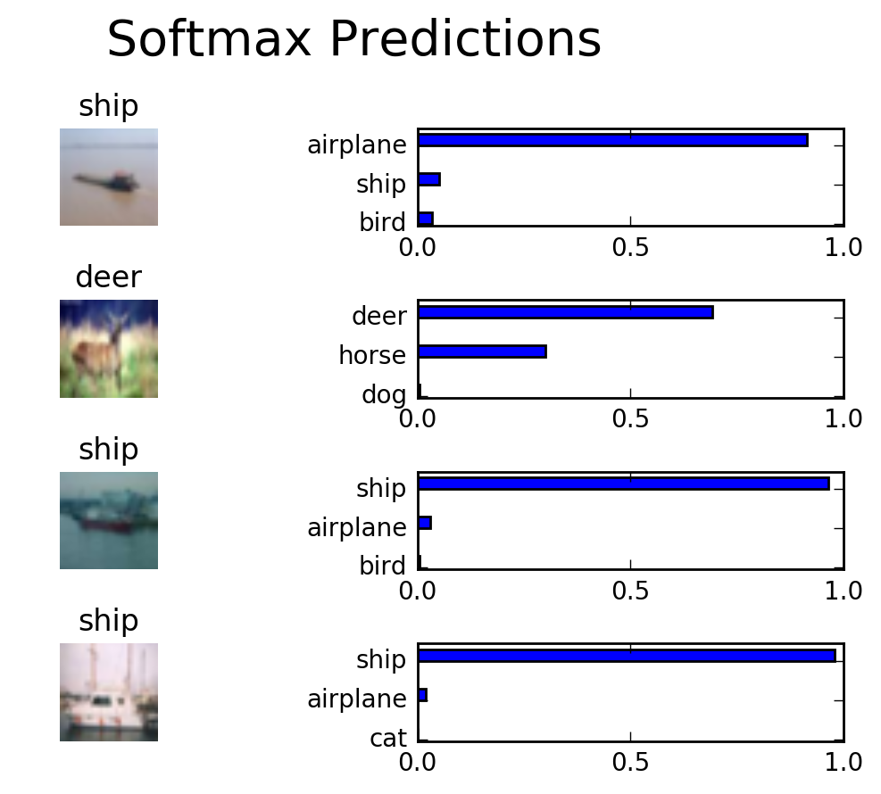

# Image Classification
In this project, you'll classify images from the [CIFAR-10 dataset](https://www.cs.toronto.edu/~kriz/cifar.html).  The dataset consists of airplanes, dogs, cats, and other objects. You'll preprocess the images, then train a convolutional neural network on all the samples. The images need to be normalized and the labels need to be one-hot encoded.  You'll get to apply what you learned and build a convolutional, max pooling, dropout, and fully connected layers.  At the end, you'll get to see your neural network's predictions on the sample images.
## Get the Data
Run the following cell to download the [CIFAR-10 dataset for python](https://www.cs.toronto.edu/~kriz/cifar-10-python.tar.gz).


```python
"""
DON'T MODIFY ANYTHING IN THIS CELL THAT IS BELOW THIS LINE
"""
from urllib.request import urlretrieve
from os.path import isfile, isdir
from tqdm import tqdm
import problem_unittests as tests
import tarfile

cifar10_dataset_folder_path = 'cifar-10-batches-py'

# Use Floyd's cifar-10 dataset if present
floyd_cifar10_location = '/input/cifar-10/python.tar.gz'
if isfile(floyd_cifar10_location):
    tar_gz_path = floyd_cifar10_location
else:
    tar_gz_path = 'cifar-10-python.tar.gz'

class DLProgress(tqdm):
    last_block = 0

    def hook(self, block_num=1, block_size=1, total_size=None):
        self.total = total_size
        self.update((block_num - self.last_block) * block_size)
        self.last_block = block_num

if not isfile(tar_gz_path):
    with DLProgress(unit='B', unit_scale=True, miniters=1, desc='CIFAR-10 Dataset') as pbar:
        urlretrieve(
            'https://www.cs.toronto.edu/~kriz/cifar-10-python.tar.gz',
            tar_gz_path,
            pbar.hook)

if not isdir(cifar10_dataset_folder_path):
    with tarfile.open(tar_gz_path) as tar:
        tar.extractall()
        tar.close()


tests.test_folder_path(cifar10_dataset_folder_path)
```

    All files found!


## Explore the Data
The dataset is broken into batches to prevent your machine from running out of memory.  The CIFAR-10 dataset consists of 5 batches, named `data_batch_1`, `data_batch_2`, etc.. Each batch contains the labels and images that are one of the following:
* airplane
* automobile
* bird
* cat
* deer
* dog
* frog
* horse
* ship
* truck

Understanding a dataset is part of making predictions on the data.  Play around with the code cell below by changing the `batch_id` and `sample_id`. The `batch_id` is the id for a batch (1-5). The `sample_id` is the id for a image and label pair in the batch.

Ask yourself "What are all possible labels?", "What is the range of values for the image data?", "Are the labels in order or random?".  Answers to questions like these will help you preprocess the data and end up with better predictions.


```python
%matplotlib inline
%config InlineBackend.figure_format = 'retina'

import helper
import numpy as np

# Explore the dataset
batch_id = 5
sample_id = 15

helper.display_stats(cifar10_dataset_folder_path, batch_id, sample_id)
```

    
    Stats of batch 5:
    Samples: 10000
    Label Counts: {0: 1014, 1: 1014, 2: 952, 3: 1016, 4: 997, 5: 1025, 6: 980, 7: 977, 8: 1003, 9: 1022}
    First 20 Labels: [1, 8, 5, 1, 5, 7, 4, 3, 8, 2, 7, 2, 0, 1, 5, 9, 6, 2, 0, 8]
    
    Example of Image 15:
    Image - Min Value: 8 Max Value: 236
    Image - Shape: (32, 32, 3)
    Label - Label Id: 9 Name: truck


## Implement Preprocess Functions
### Normalize
In the cell below, implement the `normalize` function to take in image data, `x`, and return it as a normalized Numpy array. The values should be in the range of 0 to 1, inclusive.  The return object should be the same shape as `x`.


```python
def normalize(x):
    """
    Normalize a list of sample image data in the range of 0 to 1
    : x: List of image data.  The image shape is (32, 32, 3)
    : return: Numpy array of normalize data
    """
    # TODO: Implement Function
    res = (x - 0)/255
    return res


"""
DON'T MODIFY ANYTHING IN THIS CELL THAT IS BELOW THIS LINE
"""
tests.test_normalize(normalize)
```

    Tests Passed


### One-hot encode
Just like the previous code cell, you'll be implementing a function for preprocessing.  This time, you'll implement the `one_hot_encode` function. The input, `x`, are a list of labels.  Implement the function to return the list of labels as One-Hot encoded Numpy array.  The possible values for labels are 0 to 9. The one-hot encoding function should return the same encoding for each value between each call to `one_hot_encode`.  Make sure to save the map of encodings outside the function.

Hint: Don't reinvent the wheel.


```python
def one_hot_encode(x):
    """
    One hot encode a list of sample labels. Return a one-hot encoded vector for each label.
    : x: List of sample Labels
    : return: Numpy array of one-hot encoded labels
    """
    # TODO: Implement Function
    class_list = np.array([0,1,2,3,4,5,6,7,8,9])
    return np.array([class_list==i for i in x])


"""
DON'T MODIFY ANYTHING IN THIS CELL THAT IS BELOW THIS LINE
"""
tests.test_one_hot_encode(one_hot_encode)
```

    Tests Passed


### Randomize Data
As you saw from exploring the data above, the order of the samples are randomized.  It doesn't hurt to randomize it again, but you don't need to for this dataset.

## Preprocess all the data and save it
Running the code cell below will preprocess all the CIFAR-10 data and save it to file. The code below also uses 10% of the training data for validation.


```python
"""
DON'T MODIFY ANYTHING IN THIS CELL
"""
# Preprocess Training, Validation, and Testing Data
helper.preprocess_and_save_data(cifar10_dataset_folder_path, normalize, one_hot_encode)
```

# Check Point
This is your first checkpoint.  If you ever decide to come back to this notebook or have to restart the notebook, you can start from here.  The preprocessed data has been saved to disk.


```python
"""
DON'T MODIFY ANYTHING IN THIS CELL
"""
import pickle
import problem_unittests as tests
import helper

# Load the Preprocessed Validation data
valid_features, valid_labels = pickle.load(open('preprocess_validation.p', mode='rb'))
```

## Build the network
For the neural network, you'll build each layer into a function.  Most of the code you've seen has been outside of functions. To test your code more thoroughly, we require that you put each layer in a function.  This allows us to give you better feedback and test for simple mistakes using our unittests before you submit your project.

>**Note:** If you're finding it hard to dedicate enough time for this course each week, we've provided a small shortcut to this part of the project. In the next couple of problems, you'll have the option to use classes from the [TensorFlow Layers](https://www.tensorflow.org/api_docs/python/tf/layers) or [TensorFlow Layers (contrib)](https://www.tensorflow.org/api_guides/python/contrib.layers) packages to build each layer, except the layers you build in the "Convolutional and Max Pooling Layer" section.  TF Layers is similar to Keras's and TFLearn's abstraction to layers, so it's easy to pickup.

>However, if you would like to get the most out of this course, try to solve all the problems _without_ using anything from the TF Layers packages. You **can** still use classes from other packages that happen to have the same name as ones you find in TF Layers! For example, instead of using the TF Layers version of the `conv2d` class, [tf.layers.conv2d](https://www.tensorflow.org/api_docs/python/tf/layers/conv2d), you would want to use the TF Neural Network version of `conv2d`, [tf.nn.conv2d](https://www.tensorflow.org/api_docs/python/tf/nn/conv2d). 

Let's begin!

### Input
The neural network needs to read the image data, one-hot encoded labels, and dropout keep probability. Implement the following functions
* Implement `neural_net_image_input`
 * Return a [TF Placeholder](https://www.tensorflow.org/api_docs/python/tf/placeholder)
 * Set the shape using `image_shape` with batch size set to `None`.
 * Name the TensorFlow placeholder "x" using the TensorFlow `name` parameter in the [TF Placeholder](https://www.tensorflow.org/api_docs/python/tf/placeholder).
* Implement `neural_net_label_input`
 * Return a [TF Placeholder](https://www.tensorflow.org/api_docs/python/tf/placeholder)
 * Set the shape using `n_classes` with batch size set to `None`.
 * Name the TensorFlow placeholder "y" using the TensorFlow `name` parameter in the [TF Placeholder](https://www.tensorflow.org/api_docs/python/tf/placeholder).
* Implement `neural_net_keep_prob_input`
 * Return a [TF Placeholder](https://www.tensorflow.org/api_docs/python/tf/placeholder) for dropout keep probability.
 * Name the TensorFlow placeholder "keep_prob" using the TensorFlow `name` parameter in the [TF Placeholder](https://www.tensorflow.org/api_docs/python/tf/placeholder).

These names will be used at the end of the project to load your saved model.

Note: `None` for shapes in TensorFlow allow for a dynamic size.


```python
import tensorflow as tf

def neural_net_image_input(image_shape):
    """
    Return a Tensor for a batch of image input
    : image_shape: Shape of the images
    : return: Tensor for image input.
    """
    # TODO: Implement Function
    return tf.placeholder(tf.float32, [None, image_shape[0], image_shape[1], image_shape[2]], name='x')


def neural_net_label_input(n_classes):
    """
    Return a Tensor for a batch of label input
    : n_classes: Number of classes
    : return: Tensor for label input.
    """
    # TODO: Implement Function
    return tf.placeholder(tf.float32, [None, n_classes], name='y')


def neural_net_keep_prob_input():
    """
    Return a Tensor for keep probability
    : return: Tensor for keep probability.
    """
    # TODO: Implement Function
    return tf.placeholder(tf.float32, name='keep_prob')


"""
DON'T MODIFY ANYTHING IN THIS CELL THAT IS BELOW THIS LINE
"""
tf.reset_default_graph()
tests.test_nn_image_inputs(neural_net_image_input)
tests.test_nn_label_inputs(neural_net_label_input)
tests.test_nn_keep_prob_inputs(neural_net_keep_prob_input)
```

    Image Input Tests Passed.
    Label Input Tests Passed.
    Keep Prob Tests Passed.


### Convolution and Max Pooling Layer
Convolution layers have a lot of success with images. For this code cell, you should implement the function `conv2d_maxpool` to apply convolution then max pooling:
* Create the weight and bias using `conv_ksize`, `conv_num_outputs` and the shape of `x_tensor`.
* Apply a convolution to `x_tensor` using weight and `conv_strides`.
 * We recommend you use same padding, but you're welcome to use any padding.
* Add bias
* Add a nonlinear activation to the convolution.
* Apply Max Pooling using `pool_ksize` and `pool_strides`.
 * We recommend you use same padding, but you're welcome to use any padding.

**Note:** You **can't** use [TensorFlow Layers](https://www.tensorflow.org/api_docs/python/tf/layers) or [TensorFlow Layers (contrib)](https://www.tensorflow.org/api_guides/python/contrib.layers) for **this** layer, but you can still use TensorFlow's [Neural Network](https://www.tensorflow.org/api_docs/python/tf/nn) package. You may still use the shortcut option for all the **other** layers.


```python
def conv2d_maxpool(x_tensor, conv_num_outputs, conv_ksize, conv_strides, pool_ksize, pool_strides):
    """
    Apply convolution then max pooling to x_tensor
    :param x_tensor: TensorFlow Tensor
    :param conv_num_outputs: Number of outputs for the convolutional layer
    :param conv_ksize: kernal size 2-D Tuple for the convolutional layer
    :param conv_strides: Stride 2-D Tuple for convolution
    :param pool_ksize: kernal size 2-D Tuple for pool
    :param pool_strides: Stride 2-D Tuple for pool
    : return: A tensor that represents convolution and max pooling of x_tensor
    """
    # TODO: Implement Function
    #conv_ksize = [1, conv_ksize[0], conv_ksize[1], 1]   #######BUG!!!! Misktook conv_ksize as con_strides
    
    #conv net
    conv_num_inputs = x_tensor.get_shape().as_list()[3]  #tf.to_int32(x_tensor.shape[3],  name='ToInt32')
    conv_weight = tf.Variable(tf.truncated_normal([conv_ksize[0],conv_ksize[1],conv_num_inputs,conv_num_outputs], stddev=0.1))
    conv_bias = tf.Variable(tf.zeros(conv_num_outputs))
    strides = [1,conv_strides[0],conv_strides[1],1]
    conv = tf.nn.conv2d(x_tensor,conv_weight, strides=strides,padding='SAME') + conv_bias
    conv = tf.nn.relu(conv)
    
    #max pooling
    pool_ksize = [1,pool_ksize[0],pool_ksize[1],1]
    pool_strides = [1,pool_strides[0],pool_strides[1],1]
    max_pooling_conv = tf.nn.max_pool(conv,ksize=pool_ksize,strides=pool_strides,padding='SAME')
    return max_pooling_conv


"""
DON'T MODIFY ANYTHING IN THIS CELL THAT IS BELOW THIS LINE
"""
tests.test_con_pool(conv2d_maxpool)
```

    Tests Passed


### Flatten Layer
Implement the `flatten` function to change the dimension of `x_tensor` from a 4-D tensor to a 2-D tensor.  The output should be the shape (*Batch Size*, *Flattened Image Size*). Shortcut option: you can use classes from the [TensorFlow Layers](https://www.tensorflow.org/api_docs/python/tf/layers) or [TensorFlow Layers (contrib)](https://www.tensorflow.org/api_guides/python/contrib.layers) packages for this layer. For more of a challenge, only use other TensorFlow packages.


```python
def flatten(x_tensor):
    """
    Flatten x_tensor to (Batch Size, Flattened Image Size)
    : x_tensor: A tensor of size (Batch Size, ...), where ... are the image dimensions.
    : return: A tensor of size (Batch Size, Flattened Image Size).
    """
    # TODO: Implement Function
    return tf.contrib.layers.flatten(x_tensor)


"""
DON'T MODIFY ANYTHING IN THIS CELL THAT IS BELOW THIS LINE
"""
tests.test_flatten(flatten)
```

    Tests Passed


### Fully-Connected Layer
Implement the `fully_conn` function to apply a fully connected layer to `x_tensor` with the shape (*Batch Size*, *num_outputs*). Shortcut option: you can use classes from the [TensorFlow Layers](https://www.tensorflow.org/api_docs/python/tf/layers) or [TensorFlow Layers (contrib)](https://www.tensorflow.org/api_guides/python/contrib.layers) packages for this layer. For more of a challenge, only use other TensorFlow packages.


```python
def fully_conn(x_tensor, num_outputs):
    """
    Apply a fully connected layer to x_tensor using weight and bias
    : x_tensor: A 2-D tensor where the first dimension is batch size.
    : num_outputs: The number of output that the new tensor should be.
    : return: A 2-D tensor where the second dimension is num_outputs.
    """
    # TODO: Implement Function
    return tf.contrib.layers.fully_connected(x_tensor, num_outputs)


"""
DON'T MODIFY ANYTHING IN THIS CELL THAT IS BELOW THIS LINE
"""
tests.test_fully_conn(fully_conn)
```

    Tests Passed


### Output Layer
Implement the `output` function to apply a fully connected layer to `x_tensor` with the shape (*Batch Size*, *num_outputs*). Shortcut option: you can use classes from the [TensorFlow Layers](https://www.tensorflow.org/api_docs/python/tf/layers) or [TensorFlow Layers (contrib)](https://www.tensorflow.org/api_guides/python/contrib.layers) packages for this layer. For more of a challenge, only use other TensorFlow packages.

**Note:** Activation, softmax, or cross entropy should **not** be applied to this.


```python
def output(x_tensor, num_outputs):
    """
    Apply a output layer to x_tensor using weight and bias
    : x_tensor: A 2-D tensor where the first dimension is batch size.
    : num_outputs: The number of output that the new tensor should be.
    : return: A 2-D tensor where the second dimension is num_outputs.
    """
    # TODO: Implement Function
    return tf.contrib.layers.fully_connected(x_tensor, num_outputs, activation_fn=None)

"""
DON'T MODIFY ANYTHING IN THIS CELL THAT IS BELOW THIS LINE
"""
tests.test_output(output)
```

    Tests Passed


### Create Convolutional Model
Implement the function `conv_net` to create a convolutional neural network model. The function takes in a batch of images, `x`, and outputs logits.  Use the layers you created above to create this model:

* Apply 1, 2, or 3 Convolution and Max Pool layers
* Apply a Flatten Layer
* Apply 1, 2, or 3 Fully Connected Layers
* Apply an Output Layer
* Return the output
* Apply [TensorFlow's Dropout](https://www.tensorflow.org/api_docs/python/tf/nn/dropout) to one or more layers in the model using `keep_prob`. 


```python
def conv_net(x, keep_prob):
    """
    Create a convolutional neural network model
    : x: Placeholder tensor that holds image data.
    : keep_prob: Placeholder tensor that hold dropout keep probability.
    : return: Tensor that represents logits
    """
    # TODO: Apply 1, 2, or 3 Convolution and Max Pool layers
    #    Play around with different number of outputs, kernel size and stride
    # Function Definition from Above:
    #    conv2d_maxpool(x_tensor, conv_num_outputs, conv_ksize, conv_strides, pool_ksize, pool_strides)
    print(x)
    conv = conv2d_maxpool(x,
                           conv_num_outputs=64,
                           conv_ksize=[5,5],
                           conv_strides=[1,1],
                           pool_ksize=[4,4],
                           pool_strides=[2,2])
    print(conv)
    conv = conv2d_maxpool(conv,
                          conv_num_outputs=64,
                          conv_ksize=[3,3],
                          conv_strides=[1,1],
                          pool_ksize=[2,2],
                          pool_strides=[2,2])
    print(conv)
    conv = conv2d_maxpool(conv,
                          conv_num_outputs=64,
                          conv_ksize=[2,2],
                          conv_strides=[1,1],
                          pool_ksize=[3,3],
                          pool_strides=[2,2])
    print(conv)
    #con kernel size 设为1比较好？
    
    # Apply a Flatten Layer
    flat_conv = flatten(conv)
    print(flat_conv)
    # 2 Fully-Connected Layers.
    #fc = fully_conn(flattened_conv, 512)
    fc = fully_conn(flat_conv, 128)
    print(fc)
    # Dropout layer.
    fc = tf.nn.dropout(fc, keep_prob)
    
    # Output Layer.
    return output(fc, 10)  

"""
DON'T MODIFY ANYTHING IN THIS CELL THAT IS BELOW THIS LINE
"""

##############################
## Build the Neural Network ##
##############################

# Remove previous weights, bias, inputs, etc..
tf.reset_default_graph()

# Inputs
x = neural_net_image_input((32, 32, 3))
y = neural_net_label_input(10) 
keep_prob = neural_net_keep_prob_input()

# Model
logits = conv_net(x, keep_prob)

# Name logits Tensor, so that is can be loaded from disk after training
logits = tf.identity(logits, name='logits')

# Loss and Optimizer
cost = tf.reduce_mean(tf.nn.softmax_cross_entropy_with_logits(logits=logits, labels=y))
optimizer = tf.train.AdamOptimizer().minimize(cost)

# Accuracy
correct_pred = tf.equal(tf.argmax(logits, 1), tf.argmax(y, 1))
accuracy = tf.reduce_mean(tf.cast(correct_pred, tf.float32), name='accuracy')

tests.test_conv_net(conv_net)
```

    Tensor("x:0", shape=(?, 32, 32, 3), dtype=float32)
    Tensor("MaxPool:0", shape=(?, 16, 16, 64), dtype=float32)
    Tensor("MaxPool_1:0", shape=(?, 8, 8, 64), dtype=float32)
    Tensor("MaxPool_2:0", shape=(?, 4, 4, 64), dtype=float32)
    Tensor("Flatten/Reshape:0", shape=(?, 1024), dtype=float32)
    Tensor("fully_connected/Relu:0", shape=(?, 128), dtype=float32)
    Tensor("Placeholder:0", shape=(?, 32, 32, 3), dtype=float32)
    Tensor("MaxPool_3:0", shape=(?, 16, 16, 64), dtype=float32)
    Tensor("MaxPool_4:0", shape=(?, 8, 8, 64), dtype=float32)
    Tensor("MaxPool_5:0", shape=(?, 4, 4, 64), dtype=float32)
    Tensor("Flatten_1/Reshape:0", shape=(?, 1024), dtype=float32)
    Tensor("fully_connected_2/Relu:0", shape=(?, 128), dtype=float32)
    Neural Network Built!


## Train the Neural Network
### Single Optimization
Implement the function `train_neural_network` to do a single optimization.  The optimization should use `optimizer` to optimize in `session` with a `feed_dict` of the following:
* `x` for image input
* `y` for labels
* `keep_prob` for keep probability for dropout

This function will be called for each batch, so `tf.global_variables_initializer()` has already been called.

Note: Nothing needs to be returned. This function is only optimizing the neural network.


```python
def train_neural_network(session, optimizer, keep_probability, feature_batch, label_batch):
    """
    Optimize the session on a batch of images and labels
    : session: Current TensorFlow session
    : optimizer: TensorFlow optimizer function
    : keep_probability: keep probability
    : feature_batch: Batch of Numpy image data
    : label_batch: Batch of Numpy label data
    """
    # TODO: Implement Function
    session.run(optimizer, feed_dict={x: feature_batch, #(None,32,32,3)
                                      y: label_batch,
                                      keep_prob: keep_probability
                                      })
    
    #print('accuracy:',accr)
"""
DON'T MODIFY ANYTHING IN THIS CELL THAT IS BELOW THIS LINE
"""
tests.test_train_nn(train_neural_network)
```

    Tests Passed


### Show Stats
Implement the function `print_stats` to print loss and validation accuracy.  Use the global variables `valid_features` and `valid_labels` to calculate validation accuracy.  Use a keep probability of `1.0` to calculate the loss and validation accuracy.


```python
def print_stats(session, feature_batch, label_batch, cost, accuracy):
    """
    Print information about loss and validation accuracy
    : session: Current TensorFlow session
    : feature_batch: Batch of Numpy image data
    : label_batch: Batch of Numpy label data
    : cost: TensorFlow cost function
    : accuracy: TensorFlow accuracy function
    """
    # TODO: Implement Function
    
    loss = session.run(cost, feed_dict={x: feature_batch,
                                        y: label_batch,
                                        keep_prob: 1.})
    valid_acc = session.run(accuracy, feed_dict={x: valid_features,
                                                 y: valid_labels,
                                                 keep_prob: 1.})
    print(loss, valid_acc)
```

### Hyperparameters
Tune the following parameters:
* Set `epochs` to the number of iterations until the network stops learning or start overfitting
* Set `batch_size` to the highest number that your machine has memory for.  Most people set them to common sizes of memory:
 * 64
 * 128
 * 256
 * ...
* Set `keep_probability` to the probability of keeping a node using dropout


```python
# TODO: Tune Parameters
epochs = 40
batch_size = 512
keep_probability = 0.75
```

### Train on a Single CIFAR-10 Batch
Instead of training the neural network on all the CIFAR-10 batches of data, let's use a single batch. This should save time while you iterate on the model to get a better accuracy.  Once the final validation accuracy is 50% or greater, run the model on all the data in the next section.


```python
"""
DON'T MODIFY ANYTHING IN THIS CELL
"""
print('Checking the Training on a Single Batch...')
with tf.Session() as sess:
    # Initializing the variables
    sess.run(tf.global_variables_initializer())
    
    # Training cycle
    for epoch in range(epochs):
        batch_i = 1
        for batch_features, batch_labels in helper.load_preprocess_training_batch(batch_i, batch_size):
            train_neural_network(sess, optimizer, keep_probability, batch_features, batch_labels)
        print('Epoch {:>2}, CIFAR-10 Batch {}:  '.format(epoch + 1, batch_i), end='')
        print_stats(sess, batch_features, batch_labels, cost, accuracy)
```

    Checking the Training on a Single Batch...
    Epoch  1, CIFAR-10 Batch 1:  2.16415 0.234
    Epoch  2, CIFAR-10 Batch 1:  1.99352 0.3154
    Epoch  3, CIFAR-10 Batch 1:  1.83268 0.3694
    Epoch  4, CIFAR-10 Batch 1:  1.74429 0.3884
    Epoch  5, CIFAR-10 Batch 1:  1.66053 0.4168
    Epoch  6, CIFAR-10 Batch 1:  1.59822 0.4344
    Epoch  7, CIFAR-10 Batch 1:  1.52216 0.4524
    Epoch  8, CIFAR-10 Batch 1:  1.48215 0.4608
    Epoch  9, CIFAR-10 Batch 1:  1.40063 0.485
    Epoch 10, CIFAR-10 Batch 1:  1.36138 0.5028
    Epoch 11, CIFAR-10 Batch 1:  1.30815 0.5158
    Epoch 12, CIFAR-10 Batch 1:  1.23955 0.5294
    Epoch 13, CIFAR-10 Batch 1:  1.19615 0.5474
    Epoch 14, CIFAR-10 Batch 1:  1.14775 0.5522
    Epoch 15, CIFAR-10 Batch 1:  1.17475 0.537
    Epoch 16, CIFAR-10 Batch 1:  1.11416 0.5444
    Epoch 17, CIFAR-10 Batch 1:  1.07549 0.5582
    Epoch 18, CIFAR-10 Batch 1:  1.01537 0.5678
    Epoch 19, CIFAR-10 Batch 1:  1.00924 0.5692
    Epoch 20, CIFAR-10 Batch 1:  0.961232 0.5688
    Epoch 21, CIFAR-10 Batch 1:  0.916566 0.5822
    Epoch 22, CIFAR-10 Batch 1:  0.938028 0.563
    Epoch 23, CIFAR-10 Batch 1:  0.848046 0.5882
    Epoch 24, CIFAR-10 Batch 1:  0.849767 0.587
    Epoch 25, CIFAR-10 Batch 1:  0.845707 0.579
    Epoch 26, CIFAR-10 Batch 1:  0.784807 0.592
    Epoch 27, CIFAR-10 Batch 1:  0.736665 0.6032
    Epoch 28, CIFAR-10 Batch 1:  0.743103 0.5946
    Epoch 29, CIFAR-10 Batch 1:  0.757316 0.587
    Epoch 30, CIFAR-10 Batch 1:  0.680976 0.5914
    Epoch 31, CIFAR-10 Batch 1:  0.691691 0.5814
    Epoch 32, CIFAR-10 Batch 1:  0.678632 0.5926
    Epoch 33, CIFAR-10 Batch 1:  0.647683 0.6052
    Epoch 34, CIFAR-10 Batch 1:  0.644398 0.585
    Epoch 35, CIFAR-10 Batch 1:  0.612985 0.5982
    Epoch 36, CIFAR-10 Batch 1:  0.565636 0.606
    Epoch 37, CIFAR-10 Batch 1:  0.562469 0.6088
    Epoch 38, CIFAR-10 Batch 1:  0.52209 0.6106
    Epoch 39, CIFAR-10 Batch 1:  0.478937 0.618
    Epoch 40, CIFAR-10 Batch 1:  0.454209 0.6242


### Fully Train the Model
Now that you got a good accuracy with a single CIFAR-10 batch, try it with all five batches.


```python
"""
DON'T MODIFY ANYTHING IN THIS CELL
"""
save_model_path = './image_classification'

print('Training...')
with tf.Session() as sess:
    # Initializing the variables
    sess.run(tf.global_variables_initializer())
    
    # Training cycle
    for epoch in range(epochs):
        # Loop over all batches
        n_batches = 5
        for batch_i in range(1, n_batches + 1):
            for batch_features, batch_labels in helper.load_preprocess_training_batch(batch_i, batch_size):
                train_neural_network(sess, optimizer, keep_probability, batch_features, batch_labels)
            print('Epoch {:>2}, CIFAR-10 Batch {}:  '.format(epoch + 1, batch_i), end='')
            print_stats(sess, batch_features, batch_labels, cost, accuracy)
            
    # Save Model
    saver = tf.train.Saver()
    save_path = saver.save(sess, save_model_path)
```

    Training...
    Epoch  1, CIFAR-10 Batch 1:  2.17418 0.258
    Epoch  1, CIFAR-10 Batch 2:  1.89131 0.3228
    Epoch  1, CIFAR-10 Batch 3:  1.64358 0.377
    Epoch  1, CIFAR-10 Batch 4:  1.58045 0.42
    Epoch  1, CIFAR-10 Batch 5:  1.56963 0.4292
    Epoch  2, CIFAR-10 Batch 1:  1.54586 0.4666
    Epoch  2, CIFAR-10 Batch 2:  1.42333 0.4674
    Epoch  2, CIFAR-10 Batch 3:  1.31083 0.4686
    Epoch  2, CIFAR-10 Batch 4:  1.31937 0.5128
    Epoch  2, CIFAR-10 Batch 5:  1.32095 0.526
    Epoch  3, CIFAR-10 Batch 1:  1.33398 0.5416
    Epoch  3, CIFAR-10 Batch 2:  1.23915 0.5372
    Epoch  3, CIFAR-10 Batch 3:  1.14554 0.5422
    Epoch  3, CIFAR-10 Batch 4:  1.12836 0.5546
    Epoch  3, CIFAR-10 Batch 5:  1.21002 0.5658
    Epoch  4, CIFAR-10 Batch 1:  1.21794 0.5702
    Epoch  4, CIFAR-10 Batch 2:  1.14143 0.5704
    Epoch  4, CIFAR-10 Batch 3:  1.05564 0.5798
    Epoch  4, CIFAR-10 Batch 4:  1.00022 0.6014
    Epoch  4, CIFAR-10 Batch 5:  1.08161 0.5978
    Epoch  5, CIFAR-10 Batch 1:  1.12696 0.603
    Epoch  5, CIFAR-10 Batch 2:  1.01754 0.6042
    Epoch  5, CIFAR-10 Batch 3:  0.949764 0.6148
    Epoch  5, CIFAR-10 Batch 4:  0.923416 0.6146
    Epoch  5, CIFAR-10 Batch 5:  1.01087 0.6198
    Epoch  6, CIFAR-10 Batch 1:  1.05416 0.6142
    Epoch  6, CIFAR-10 Batch 2:  0.950968 0.6322
    Epoch  6, CIFAR-10 Batch 3:  0.872351 0.63
    Epoch  6, CIFAR-10 Batch 4:  0.865606 0.6376
    Epoch  6, CIFAR-10 Batch 5:  0.914406 0.6468
    Epoch  7, CIFAR-10 Batch 1:  0.962058 0.6478
    Epoch  7, CIFAR-10 Batch 2:  0.912675 0.6268
    Epoch  7, CIFAR-10 Batch 3:  0.86336 0.6404
    Epoch  7, CIFAR-10 Batch 4:  0.83486 0.6438
    Epoch  7, CIFAR-10 Batch 5:  0.849887 0.6598
    Epoch  8, CIFAR-10 Batch 1:  0.926978 0.6496
    Epoch  8, CIFAR-10 Batch 2:  0.833552 0.6654
    Epoch  8, CIFAR-10 Batch 3:  0.76524 0.6634
    Epoch  8, CIFAR-10 Batch 4:  0.731668 0.6704
    Epoch  8, CIFAR-10 Batch 5:  0.795204 0.6678
    Epoch  9, CIFAR-10 Batch 1:  0.875858 0.6724
    Epoch  9, CIFAR-10 Batch 2:  0.80453 0.6646
    Epoch  9, CIFAR-10 Batch 3:  0.735106 0.677
    Epoch  9, CIFAR-10 Batch 4:  0.701202 0.6728
    Epoch  9, CIFAR-10 Batch 5:  0.739197 0.6792
    Epoch 10, CIFAR-10 Batch 1:  0.78771 0.6786
    Epoch 10, CIFAR-10 Batch 2:  0.758499 0.6826
    Epoch 10, CIFAR-10 Batch 3:  0.677896 0.691
    Epoch 10, CIFAR-10 Batch 4:  0.636346 0.6832
    Epoch 10, CIFAR-10 Batch 5:  0.703204 0.6872
    Epoch 11, CIFAR-10 Batch 1:  0.74469 0.6894
    Epoch 11, CIFAR-10 Batch 2:  0.712101 0.6886
    Epoch 11, CIFAR-10 Batch 3:  0.659332 0.6862
    Epoch 11, CIFAR-10 Batch 4:  0.619165 0.6842
    Epoch 11, CIFAR-10 Batch 5:  0.668411 0.6958
    Epoch 12, CIFAR-10 Batch 1:  0.722821 0.6962
    Epoch 12, CIFAR-10 Batch 2:  0.666356 0.6844
    Epoch 12, CIFAR-10 Batch 3:  0.648884 0.6896
    Epoch 12, CIFAR-10 Batch 4:  0.578291 0.6978
    Epoch 12, CIFAR-10 Batch 5:  0.613525 0.6992
    Epoch 13, CIFAR-10 Batch 1:  0.691871 0.702
    Epoch 13, CIFAR-10 Batch 2:  0.674262 0.6712
    Epoch 13, CIFAR-10 Batch 3:  0.617314 0.6954
    Epoch 13, CIFAR-10 Batch 4:  0.54744 0.7082
    Epoch 13, CIFAR-10 Batch 5:  0.605175 0.7018
    Epoch 14, CIFAR-10 Batch 1:  0.695072 0.683
    Epoch 14, CIFAR-10 Batch 2:  0.634088 0.696
    Epoch 14, CIFAR-10 Batch 3:  0.646989 0.6886
    Epoch 14, CIFAR-10 Batch 4:  0.515303 0.7086
    Epoch 14, CIFAR-10 Batch 5:  0.598033 0.7004
    Epoch 15, CIFAR-10 Batch 1:  0.642724 0.7036
    Epoch 15, CIFAR-10 Batch 2:  0.597932 0.7012
    Epoch 15, CIFAR-10 Batch 3:  0.570637 0.7048
    Epoch 15, CIFAR-10 Batch 4:  0.499778 0.7078
    Epoch 15, CIFAR-10 Batch 5:  0.542088 0.7058
    Epoch 16, CIFAR-10 Batch 1:  0.647928 0.7008
    Epoch 16, CIFAR-10 Batch 2:  0.596136 0.6972
    Epoch 16, CIFAR-10 Batch 3:  0.589553 0.6982
    Epoch 16, CIFAR-10 Batch 4:  0.491102 0.7102
    Epoch 16, CIFAR-10 Batch 5:  0.511343 0.7108
    Epoch 17, CIFAR-10 Batch 1:  0.628615 0.6992
    Epoch 17, CIFAR-10 Batch 2:  0.590861 0.6938
    Epoch 17, CIFAR-10 Batch 3:  0.514383 0.715
    Epoch 17, CIFAR-10 Batch 4:  0.465944 0.7198
    Epoch 17, CIFAR-10 Batch 5:  0.487415 0.72
    Epoch 18, CIFAR-10 Batch 1:  0.581234 0.7102
    Epoch 18, CIFAR-10 Batch 2:  0.528197 0.7082
    Epoch 18, CIFAR-10 Batch 3:  0.517984 0.7158
    Epoch 18, CIFAR-10 Batch 4:  0.448379 0.7244
    Epoch 18, CIFAR-10 Batch 5:  0.466885 0.719
    Epoch 19, CIFAR-10 Batch 1:  0.557558 0.7158
    Epoch 19, CIFAR-10 Batch 2:  0.485483 0.7176
    Epoch 19, CIFAR-10 Batch 3:  0.466662 0.7118
    Epoch 19, CIFAR-10 Batch 4:  0.432227 0.719
    Epoch 19, CIFAR-10 Batch 5:  0.449991 0.7208
    Epoch 20, CIFAR-10 Batch 1:  0.542111 0.7226
    Epoch 20, CIFAR-10 Batch 2:  0.507359 0.699
    Epoch 20, CIFAR-10 Batch 3:  0.450182 0.7198
    Epoch 20, CIFAR-10 Batch 4:  0.398063 0.726
    Epoch 20, CIFAR-10 Batch 5:  0.416526 0.7272
    Epoch 21, CIFAR-10 Batch 1:  0.519584 0.7102
    Epoch 21, CIFAR-10 Batch 2:  0.467399 0.7084
    Epoch 21, CIFAR-10 Batch 3:  0.433236 0.7142
    Epoch 21, CIFAR-10 Batch 4:  0.391417 0.7226
    Epoch 21, CIFAR-10 Batch 5:  0.42498 0.7218
    Epoch 22, CIFAR-10 Batch 1:  0.516996 0.7216
    Epoch 22, CIFAR-10 Batch 2:  0.4438 0.7234
    Epoch 22, CIFAR-10 Batch 3:  0.397908 0.7256
    Epoch 22, CIFAR-10 Batch 4:  0.365478 0.7238
    Epoch 22, CIFAR-10 Batch 5:  0.401759 0.7214
    Epoch 23, CIFAR-10 Batch 1:  0.526016 0.7132
    Epoch 23, CIFAR-10 Batch 2:  0.451511 0.7196
    Epoch 23, CIFAR-10 Batch 3:  0.385383 0.7204
    Epoch 23, CIFAR-10 Batch 4:  0.36932 0.7208
    Epoch 23, CIFAR-10 Batch 5:  0.381374 0.7292
    Epoch 24, CIFAR-10 Batch 1:  0.517261 0.7204
    Epoch 24, CIFAR-10 Batch 2:  0.404438 0.7268
    Epoch 24, CIFAR-10 Batch 3:  0.418854 0.7182
    Epoch 24, CIFAR-10 Batch 4:  0.366863 0.721
    Epoch 24, CIFAR-10 Batch 5:  0.3707 0.7194
    Epoch 25, CIFAR-10 Batch 1:  0.46969 0.7174
    Epoch 25, CIFAR-10 Batch 2:  0.383327 0.7256
    Epoch 25, CIFAR-10 Batch 3:  0.358435 0.7294
    Epoch 25, CIFAR-10 Batch 4:  0.358246 0.7166
    Epoch 25, CIFAR-10 Batch 5:  0.356147 0.7236
    Epoch 26, CIFAR-10 Batch 1:  0.445827 0.7256
    Epoch 26, CIFAR-10 Batch 2:  0.402569 0.72
    Epoch 26, CIFAR-10 Batch 3:  0.360069 0.73
    Epoch 26, CIFAR-10 Batch 4:  0.347298 0.7152
    Epoch 26, CIFAR-10 Batch 5:  0.347091 0.7248
    Epoch 27, CIFAR-10 Batch 1:  0.453929 0.723
    Epoch 27, CIFAR-10 Batch 2:  0.351294 0.7322
    Epoch 27, CIFAR-10 Batch 3:  0.329644 0.7398
    Epoch 27, CIFAR-10 Batch 4:  0.345249 0.7226
    Epoch 27, CIFAR-10 Batch 5:  0.323675 0.7316
    Epoch 28, CIFAR-10 Batch 1:  0.415203 0.721
    Epoch 28, CIFAR-10 Batch 2:  0.371486 0.7228
    Epoch 28, CIFAR-10 Batch 3:  0.340016 0.7334
    Epoch 28, CIFAR-10 Batch 4:  0.319217 0.7262
    Epoch 28, CIFAR-10 Batch 5:  0.334795 0.7242
    Epoch 29, CIFAR-10 Batch 1:  0.428957 0.7106
    Epoch 29, CIFAR-10 Batch 2:  0.370579 0.7168
    Epoch 29, CIFAR-10 Batch 3:  0.378746 0.7388
    Epoch 29, CIFAR-10 Batch 4:  0.32033 0.7232
    Epoch 29, CIFAR-10 Batch 5:  0.311448 0.7318
    Epoch 30, CIFAR-10 Batch 1:  0.419881 0.708
    Epoch 30, CIFAR-10 Batch 2:  0.322512 0.736
    Epoch 30, CIFAR-10 Batch 3:  0.31532 0.7312
    Epoch 30, CIFAR-10 Batch 4:  0.278237 0.7322
    Epoch 30, CIFAR-10 Batch 5:  0.290007 0.7312
    Epoch 31, CIFAR-10 Batch 1:  0.38046 0.7234
    Epoch 31, CIFAR-10 Batch 2:  0.339483 0.7314
    Epoch 31, CIFAR-10 Batch 3:  0.284596 0.738
    Epoch 31, CIFAR-10 Batch 4:  0.256927 0.7408
    Epoch 31, CIFAR-10 Batch 5:  0.264829 0.7328
    Epoch 32, CIFAR-10 Batch 1:  0.353531 0.7196
    Epoch 32, CIFAR-10 Batch 2:  0.344512 0.7264
    Epoch 32, CIFAR-10 Batch 3:  0.275394 0.7372
    Epoch 32, CIFAR-10 Batch 4:  0.250398 0.7348
    Epoch 32, CIFAR-10 Batch 5:  0.263489 0.7318
    Epoch 33, CIFAR-10 Batch 1:  0.341413 0.722
    Epoch 33, CIFAR-10 Batch 2:  0.349035 0.7186
    Epoch 33, CIFAR-10 Batch 3:  0.294038 0.7286
    Epoch 33, CIFAR-10 Batch 4:  0.278225 0.7366
    Epoch 33, CIFAR-10 Batch 5:  0.250861 0.7402
    Epoch 34, CIFAR-10 Batch 1:  0.324521 0.7234
    Epoch 34, CIFAR-10 Batch 2:  0.369276 0.7194
    Epoch 34, CIFAR-10 Batch 3:  0.306543 0.7272
    Epoch 34, CIFAR-10 Batch 4:  0.284653 0.7214
    Epoch 34, CIFAR-10 Batch 5:  0.263262 0.7314
    Epoch 35, CIFAR-10 Batch 1:  0.323842 0.7224
    Epoch 35, CIFAR-10 Batch 2:  0.376572 0.7226
    Epoch 35, CIFAR-10 Batch 3:  0.325775 0.714
    Epoch 35, CIFAR-10 Batch 4:  0.266008 0.733
    Epoch 35, CIFAR-10 Batch 5:  0.255277 0.7346
    Epoch 36, CIFAR-10 Batch 1:  0.326463 0.7228
    Epoch 36, CIFAR-10 Batch 2:  0.316385 0.7308
    Epoch 36, CIFAR-10 Batch 3:  0.269 0.7256
    Epoch 36, CIFAR-10 Batch 4:  0.251647 0.7342
    Epoch 36, CIFAR-10 Batch 5:  0.224504 0.7382
    Epoch 37, CIFAR-10 Batch 1:  0.320176 0.7266
    Epoch 37, CIFAR-10 Batch 2:  0.261291 0.7406
    Epoch 37, CIFAR-10 Batch 3:  0.24623 0.7318
    Epoch 37, CIFAR-10 Batch 4:  0.233286 0.7338
    Epoch 37, CIFAR-10 Batch 5:  0.225085 0.7356
    Epoch 38, CIFAR-10 Batch 1:  0.285046 0.731
    Epoch 38, CIFAR-10 Batch 2:  0.267369 0.7332
    Epoch 38, CIFAR-10 Batch 3:  0.288629 0.7184
    Epoch 38, CIFAR-10 Batch 4:  0.229647 0.732
    Epoch 38, CIFAR-10 Batch 5:  0.214168 0.7354
    Epoch 39, CIFAR-10 Batch 1:  0.267609 0.7278
    Epoch 39, CIFAR-10 Batch 2:  0.274509 0.7384
    Epoch 39, CIFAR-10 Batch 3:  0.264205 0.7302
    Epoch 39, CIFAR-10 Batch 4:  0.252471 0.7308
    Epoch 39, CIFAR-10 Batch 5:  0.224979 0.734
    Epoch 40, CIFAR-10 Batch 1:  0.251603 0.7306
    Epoch 40, CIFAR-10 Batch 2:  0.277763 0.7348
    Epoch 40, CIFAR-10 Batch 3:  0.288197 0.7162
    Epoch 40, CIFAR-10 Batch 4:  0.243268 0.7348
    Epoch 40, CIFAR-10 Batch 5:  0.231756 0.7248


# Checkpoint
The model has been saved to disk.
## Test Model
Test your model against the test dataset.  This will be your final accuracy. You should have an accuracy greater than 50%. If you don't, keep tweaking the model architecture and parameters.


```python
"""
DON'T MODIFY ANYTHING IN THIS CELL
"""
%matplotlib inline
%config InlineBackend.figure_format = 'retina'

import tensorflow as tf
import pickle
import helper
import random

# Set batch size if not already set
try:
    if batch_size:
        pass
except NameError:
    batch_size = 64

save_model_path = './image_classification'
n_samples = 4
top_n_predictions = 3

def test_model():
    """
    Test the saved model against the test dataset
    """

    test_features, test_labels = pickle.load(open('preprocess_test.p', mode='rb'))
    loaded_graph = tf.Graph()

    with tf.Session(graph=loaded_graph) as sess:
        # Load model
        loader = tf.train.import_meta_graph(save_model_path + '.meta')
        loader.restore(sess, save_model_path)

        # Get Tensors from loaded model
        loaded_x = loaded_graph.get_tensor_by_name('x:0')
        loaded_y = loaded_graph.get_tensor_by_name('y:0')
        loaded_keep_prob = loaded_graph.get_tensor_by_name('keep_prob:0')
        loaded_logits = loaded_graph.get_tensor_by_name('logits:0')
        loaded_acc = loaded_graph.get_tensor_by_name('accuracy:0')
        
        # Get accuracy in batches for memory limitations
        test_batch_acc_total = 0
        test_batch_count = 0
        
        for test_feature_batch, test_label_batch in helper.batch_features_labels(test_features, test_labels, batch_size):
            test_batch_acc_total += sess.run(
                loaded_acc,
                feed_dict={loaded_x: test_feature_batch, loaded_y: test_label_batch, loaded_keep_prob: 1.0})
            test_batch_count += 1

        print('Testing Accuracy: {}\n'.format(test_batch_acc_total/test_batch_count))

        # Print Random Samples
        random_test_features, random_test_labels = tuple(zip(*random.sample(list(zip(test_features, test_labels)), n_samples)))
        random_test_predictions = sess.run(
            tf.nn.top_k(tf.nn.softmax(loaded_logits), top_n_predictions),
            feed_dict={loaded_x: random_test_features, loaded_y: random_test_labels, loaded_keep_prob: 1.0})
        helper.display_image_predictions(random_test_features, random_test_labels, random_test_predictions)


test_model()
```

    INFO:tensorflow:Restoring parameters from ./image_classification
    Testing Accuracy: 0.7232766538858414
    





## Why 50-80% Accuracy?
You might be wondering why you can't get an accuracy any higher. First things first, 50% isn't bad for a simple CNN.  Pure guessing would get you 10% accuracy. However, you might notice people are getting scores [well above 80%](http://rodrigob.github.io/are_we_there_yet/build/classification_datasets_results.html#43494641522d3130).  That's because we haven't taught you all there is to know about neural networks. We still need to cover a few more techniques.
## Submitting This Project
When submitting this project, make sure to run all the cells before saving the notebook.  Save the notebook file as "dlnd_image_classification.ipynb" and save it as a HTML file under "File" -> "Download as".  Include the "helper.py" and "problem_unittests.py" files in your submission.


```python

```


```python

```


```python

```


```python

```
